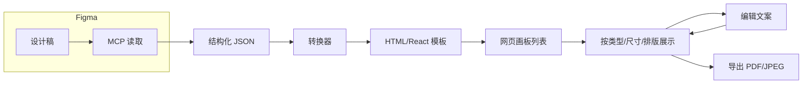

# KV 延展海报批量制作工具 — 工作流设计

## 一、目标概述

基于 **Figma MCP** 将已设计好的 KV 转化为**网页模板**，支持：
- 按 **KV 元素类型** 分类展示画板（画布）
- 多**尺寸**延展（如 1:1 / 4:5 / 9:16 等）
- 每模板 **2–3 种创意排版** 变体
- 网页内**编辑文案**、**下载 PDF / JPEG**

---

## 二、KV 元素与字段约定

| 元素类型 | 说明 | 可编辑 | 建议 Figma 命名/约定 |
|---------|------|--------|----------------------|
| **字体/排版** | 主标题用字、层级 | 否（样式） | `Typography` / 文本样式 |
| **主标题** | 主标题文案 | ✅ 是 | `mainTitle` / 图层名含 "主标题" |
| **副标题** | 副标题文案 | ✅ 是 | `subTitle` |
| **时间** | 活动/发布时间 | ✅ 是 | `date` / `time` |
| **主元素** | 主视觉图/插画 | 可替换图 | `hero` / `mainVisual` |
| **背景** | 背景图或色块 | 可替换 | `background` |
| **辅助小元素** | 装饰、图标、角标 | 可选替换 | `deco` / `badge` / 等 |

**固定字段（必填）**：`主标题`、`副标题`、`时间`。模板中需预留对应占位节点，便于在网页中绑定并编辑。

---

## 三、整体工作流架构

```
┌─────────────────────────────────────────────────────────────────────────────┐
│  Phase 0: Figma 设计规范（人工 + 约定）                                        │
│  - 画板命名、图层命名、组件命名与 KV 元素类型一一对应                            │
│  - 每个「模板」= 一个 Frame/画板；尺寸固定；2–3 个排版变体 = 2–3 个画板/页面     │
└─────────────────────────────────────────────────────────────────────────────┘
                                        │
                                        ▼
┌─────────────────────────────────────────────────────────────────────────────┐
│  Phase 1: Figma MCP 拉取设计数据                                               │
│  - 通过 MCP 读取文件/页面/节点树、样式、图片导出 URL                            │
│  - 输出：结构化 JSON（节点树 + 尺寸 + 文本 + 图片 + 样式）                     │
└─────────────────────────────────────────────────────────────────────────────┘
                                        │
                                        ▼
┌─────────────────────────────────────────────────────────────────────────────┐
│  Phase 2: 设计 → 网页模板转换（转换器）                                        │
│  - 解析 JSON → 映射为「模板 + 画板 + KV 元素」数据模型                           │
│  - 生成 HTML/CSS 或 React 组件（每个画板 = 一个可渲染的模板实例）                │
│  - 可编辑节点绑定 data-field（如 data-field="mainTitle"）                      │
└─────────────────────────────────────────────────────────────────────────────┘
                                        │
                                        ▼
┌─────────────────────────────────────────────────────────────────────────────┐
│  Phase 3: 网页应用（画板展示 + 编辑 + 导出）                                   │
│  - 按「模板 × 尺寸 × 排版」或「KV 元素类型」分类展示画板                        │
│  - 画板内：主标题/副标题/时间 内联编辑                                         │
│  - 导出：PDF（如 html2pdf.js / jsPDF）+ JPEG（如 html2canvas）                 │
└─────────────────────────────────────────────────────────────────────────────┘
```

---

## 四、Phase 0：Figma 设计规范（前置约定）

在 Figma 中统一约定，便于 MCP 与转换器解析：

1. **文件/页面**
   - 一个「模板」对应一个**页面**或一组**同名前缀的 Frame**。
   - 同一模板的 2–3 种排版 = 2–3 个同级 Frame，命名如：`Poster_1x1_LayoutA`、`Poster_1x1_LayoutB`。

2. **画板尺寸**
   - 每个 Frame 固定宽高（如 1080×1080、1080×1350、1080×1920），与「尺寸类型」一一对应。

3. **图层/组件命名与 KV 类型映射**
   - 主标题：`mainTitle` 或包含「主标题」的文本图层。
   - 副标题：`subTitle`。
   - 时间：`date` 或 `time`。
   - 主视觉：`hero` / `mainVisual`。
   - 背景：`background`。
   - 辅助元素：`deco`、`badge` 等（可按需细分类）。

4. **导出资源**
   - 图片、矢量需能从 Figma 拿到导出 URL（MCP 或 Export API），转换器下载或直链引用。

产出：一份**设计规范文档**（给设计师）+ 可选 **Figma 组件库/模板库**，保证新稿都按同一约定制作。

---

## 五、Phase 1：Figma MCP 拉取设计数据

**目标**：用 Figma MCP（如 Talk To Figma / Figma Plugin API）把当前文件中的目标画板拉成结构化数据。

**步骤建议**：

1. **连接与选文件**
   - 使用 MCP 连接 Figma（如 `join_channel`），并指定要读取的 **File Key** 与**页面**。

2. **获取节点树**
   - 调用 MCP 获取文档/页面/Frame 的节点树（含类型、名称、bounds、子节点）。
   - 筛选出「画板」级 Frame（按命名或尺寸过滤）。

3. **获取样式与文本**
   - 对每个文本节点：取字体、字号、颜色、对齐等。
   - 对填充/描边：取色值、渐变等，写入中间 JSON。

4. **获取图片资源**
   - 对 IMAGE、含导出资源的节点，通过 MCP 或 Export API 拿到图片 URL（或 base64），写入资源表。

5. **输出结构（示例）**

```json
{
  "templateId": "event-poster-2025",
  "templateName": "活动海报",
  "artboards": [
    {
      "id": "artboard-1",
      "name": "Poster_1x1_LayoutA",
      "width": 1080,
      "height": 1080,
      "sizeType": "1:1",
      "layoutVariant": "A",
      "nodes": [
        {
          "id": "node-mainTitle",
          "type": "TEXT",
          "role": "mainTitle",
          "characters": "活动主标题",
          "style": { "fontSize": 48, "fontFamily": "...", "fills": [...] },
          "bounds": { "x": 100, "y": 200, "width": 800, "height": 60 }
        },
        {
          "id": "node-subTitle",
          "type": "TEXT",
          "role": "subTitle",
          "characters": "副标题文案",
          "style": { ... },
          "bounds": { ... }
        },
        {
          "id": "node-date",
          "type": "TEXT",
          "role": "date",
          "characters": "2025.03.15",
          "style": { ... },
          "bounds": { ... }
        },
        {
          "id": "node-hero",
          "type": "RECTANGLE",
          "role": "mainVisual",
          "exportUrl": "https://...",
          "bounds": { ... }
        },
        {
          "id": "node-bg",
          "type": "RECTANGLE",
          "role": "background",
          "fills": [...],
          "bounds": { ... }
        }
      ],
      "decorations": [
        { "id": "node-deco-1", "role": "deco", "exportUrl": "...", "bounds": { ... } }
      ]
    }
  ],
  "assets": {
    "node-hero": "https://...",
    "node-deco-1": "https://..."
  }
}
```

**角色（role）** 的判定：优先按**图层/组件名称**匹配上表的 KV 类型；若无，可在转换器里做启发式规则（如最大字号文本 → mainTitle）。

---

## 六、Phase 2：设计数据 → 网页模板转换器

**目标**：把 Phase 1 的 JSON 转成可在浏览器中渲染、可编辑、可导出的网页模板。

**2.1 数据模型（模板 + 画板 + 可编辑字段）**

- **Template**：一个活动/一个 KV 主题，对应多尺寸 × 多排版。
- **Artboard**：单张「画板」，对应一个尺寸 + 一个排版变体，包含若干 **KV 元素**。
- **EditableField**：主标题、副标题、时间等，在网页中绑定到 `contentEditable` 或 `<input>`，并带 `data-field`。

**2.2 转换规则（Figma 节点 → HTML/CSS）**

- **背景**：有图用 ``/`background-image`，纯色用 `background-color`，保留绝对定位与宽高。
- **主标题/副标题/时间**：用 `<div>` 或 `<span>`，保留字体/字号/颜色，设 `contentEditable` 或封装为可编辑组件，并设 `data-field="mainTitle"` 等。
- **主元素/辅助元素**：图片用 ``，矢量可 SVG 内联或 ``，位置用 `position: absolute` + left/top/width/height（由 bounds 换算为 % 或 px）。

**2.3 输出形态**

- **方案 A**：每个画板生成一份 **静态 HTML + 内联/外链 CSS**，由前端按「画板 ID」加载并渲染。
- **方案 B**：生成 **React 组件**（如 `<PosterArtboard data={artboard} fields={fields} />`），便于集成到同一 SPA，状态统一（编辑内容、导出）。

**2.4 尺寸与排版**

- 画板宽高来自 Figma（如 1080×1080），在网页里用固定宽高容器（如 `width: 1080px; height: 1080px`）或按比例缩放展示；导出 PDF/JPEG 时用设计尺寸以保证清晰度。
- 2–3 种排版 = 2–3 个 Artboard，在列表中按 `layoutVariant`（A/B/C）展示，用户选其一再编辑/导出。

---

## 七、Phase 3：网页应用（画板展示、编辑、导出）

**7.1 画板分类展示**

- **按 KV 元素类型**：左侧或顶部分类（主标题、副标题、时间、主元素、背景、辅助元素），点击后右侧只展示「包含该元素」的画板缩略图或列表。
- **按模板 + 尺寸 + 排版**：树形或筛选器（模板 → 尺寸类型 → 排版 A/B/C），每个叶子对应一个画板。

**7.2 画板内编辑**

- 主标题、副标题、时间：点击画板内对应区域即可编辑（contentEditable 或弹窗表单），变更写入全局状态（如 React state / Zustand），实时刷新画板预览。
- 可选：右侧面板「字段列表」统一编辑，再同步到画板。

**7.3 导出**

- **JPEG**：用 `html2canvas` 对当前画板 DOM 截图，再 `canvas.toDataURL('image/jpeg')` 触发下载。
- **PDF**：用 `jsPDF` + `html2canvas` 将画板转为图后插入 PDF；或服务端用 Puppeteer 渲染 HTML 再生成 PDF（更适合多页/批量）。

**7.4 技术栈建议**

| 层级 | 建议 |
|------|------|
| 框架 | Next.js 或 Vite + React |
| 状态 | 模板/画板/当前编辑字段 → React state 或 Zustand |
| 画板渲染 | 由 Phase 2 生成的 HTML/React 组件，按 artboard 数据渲染 |
| 导出 | 前端：html2canvas + jsPDF；批量/高质量可走后端 Puppeteer |
| 样式 | 转换器生成的 CSS 或 CSS-in-JS（保持与 Figma 一致） |

---

## 八、多尺寸与多排版延展

- **尺寸类型**：在 Figma 中为每个尺寸建独立画板（如 1:1、4:5、9:16），Phase 1 按 `width/height` 或命名解析出 `sizeType`，Phase 2 原样保留尺寸生成模板。
- **2–3 种排版**：同一尺寸下 2–3 个 Frame（LayoutA/B/C），转换后即 2–3 个 Artboard，在网页中作为同一模板的「排版变体」切换展示与编辑。
- **延展流程**：设计师在 Figma 复制画板 → 改排版/元素位置 → 保持命名与 role 约定 → 重新跑 Phase 1 + Phase 2，即可把新画板加入同一模板或新模板。

---

## 九、实施阶段建议

| 阶段 | 内容 | 产出 |
|------|------|------|
| **M1** | Figma 命名规范文档 + 示例模板（1 个模板、1 尺寸、1 排版） | 设计规范 + 示例 Figma 文件 |
| **M2** | Phase 1：Figma MCP 对接，拉取节点树/样式/图片 → JSON | 可运行的「Figma → JSON」脚本或 MCP 调用流程 |
| **M3** | Phase 2：JSON → 单画板 HTML/CSS 或 React 组件（可编辑占位） | 转换器 + 单画板可编辑页 |
| **M4** | Phase 3：多画板列表、按类型/尺寸/排版分类、编辑状态同步 | 画板列表与分类 UI + 编辑联动 |
| **M5** | 导出 JPEG/PDF + 多尺寸多排版完整流程联调 | 导出功能 + 端到端测试 |

---

## 十、附录：Figma MCP 使用要点

- **Talk To Figma**：需在 Figma 中打开插件并连接，Cursor 侧通过 MCP 与插件通信，可读取当前选中节点、页面结构等。
- **可用的 MCP 能力**（视实际插件而定）：获取文档结构、节点属性、导出图片、获取样式。若插件不支持导出，可退而用 Figma REST API（需 token）做 Export。
- **自动化**：Phase 1 可做成「从 Cursor 执行脚本 → 调 MCP → 写 JSON 到本地」；或 Figma 插件内直接导出 JSON，再由本地转换器消费。

---

本工作流将 **Figma 设计 → 结构化数据 → 网页模板 → 分类画板、编辑、导出** 串成一条清晰管线，按阶段实现即可逐步落地 KV 延展海报批量制作工具。若你希望先从某一 Phase 的详细接口设计或示例代码开始，可以指定阶段（例如 Phase 1 的 JSON Schema 或 Phase 3 的页面结构）。

---

## 十一、数据模型与 Figma→Web 映射表

### 11.1 KV 角色（role）与 HTML/编辑方式

| Figma 约定名 / 规则 | role | 网页形态 | 是否可编辑 |
|---------------------|------|----------|------------|
| `mainTitle` / 主标题 | mainTitle | 单行或多行文本块 | ✅ contentEditable 或 input |
| `subTitle` | subTitle | 文本块 | ✅ 同上 |
| `date` / `time` | date | 文本块 | ✅ 同上 |
| `hero` / `mainVisual` | mainVisual | `` 或 `<div>` 背景图 | 可替换 URL（后续扩展） |
| `background` | background | 背景层（图/色） | 可替换（后续扩展） |
| `deco` / `badge` 等 | deco | `` 或 SVG | 可选替换 |

### 11.2 画板分类与前端路由建议

- **按 KV 类型筛选**：`/posters?element=mainTitle`、`?element=background` 等，只渲染包含该元素类型的画板。
- **按模板+尺寸+排版**：`/posters/:templateId/:sizeType/:layoutVariant`，直接打开某一画板编辑/导出。

### 11.3 流程简图（Mermaid）



### 11.4 技术栈汇总

| 环节 | 推荐技术 |
|------|----------|
| Figma 对接 | Talk To Figma MCP / Figma REST API（Export） |
| 转换器 | Node.js 脚本，输入 JSON 输出 HTML 或 React 组件 |
| 前端 | Next.js App Router 或 Vite+React，Zustand 存模板/画板/编辑字段 |
| 导出 JPEG | html2canvas |
| 导出 PDF | jsPDF + html2canvas，或服务端 Puppeteer |
| 部署 | 静态导出或 Node 服务（若用服务端 PDF） |
